> ## 학습 목표 {.objectives}
>
> * `ggplot2` 팩키지를 사용해서 논문품질 그래프를 생성할 수 있다.
> * 그래픽 문법(Grammar of Graphics)의 기초를 이해한다:
>   - 미학 계층
>   - 기하 계층
>   - 통계량 추가
>   - 척도 변환
>   - 집단별 색깔입히기 혹은 창으로 구분 
>

데이터를 도식화하는 것이 변수 다양한 관계를 재빨리 탐색하는 최상의 방식 중 하나다.

R에는 세가지 주류 도식화 시스템이 존재한다: [기본 도식화 시스템][base],[lattice][lattice]
팩키지, [ggplot2][ggplot2] 팩키지.

[base]: http://www.statmethods.net/graphs/
[lattice]: http://www.statmethods.net/advgraphs/trellis.html
[ggplot2]: http://www.statmethods.net/advgraphs/ggplot2.html

`ggplot2` 팩키지를 학습하는데 이유는 논문품질 그래프 생성에 있어 가장 효과적이기 때문이다.

`ggplot2`는 그래픽 문법에 기반했다. 즉, 어떤 그래프도 동일한 구성요소 집합으로 표현된다: 
**데이터** 집합, **좌표 시스템**, **geoms** 집합 -- 데이터 점에 대한 시각적 표현.

`ggplot2`를 이해하는 핵심은 그림을 계층으로 사고하는 것이다: 
포토샵, 일러스트레이터, 잉크스케이프 같은 이미지 편집 프로그램으로 작업하는 것과 같다.

예제를 가지고 시작해본다:

~~~{.r}
library(ggplot2)
ggplot(data = gapminder, aes(x = lifeExp, y = gdpPercap)) +
  geom_point()
~~~

그래서, 처음으로 수행하는 작업은 `ggplot` 함수를 호출하는 것이다. 
이 함수가 R에게 새로운 그림을 생성하고, 
`ggplot` 함수에 전달하는 어떤 인자도 해당 그림에 *전역* 선택옵션(그림에 있는 모든 계층에 적용)임을 전달한다.

`ggplot`에 인자를 두개 전달했다.
먼저, `ggplot`에 그림에 사용할 데이터가 무엇인지 전달한다; 
번 예제에서 앞에서 불러온 `gapminder`데이터.
두번째 인자를 `aes`함수에 전달했는데, 
`ggplot`에게 **데이터**에 나온 변수를 도식화하는 그림의 *미학적인* 속성에 매핑하는 방법을 전달한다; 
이번 경우에는 **x**와 **y** 위치. 여기서 `ggplot`에 `gapminder`데이터프레임 "lifeExp" 칼럼을 **x**-축에, 
"gdpPercap" 칼럼을 **y**-축에 도식화한다. 
명시적으로 `aes`에 칼럼명을 전달(예를 들어, x = gapminder[, "lifeExp"]`)하지 않은 것에 주목한다. 
이것이 가능한 이유는 `ggplot` 함수가 **데이터**에 존재하는 칼럼을 식별할만큼 똑똑하기 때문이다!

그 자체로, `ggplot`함수를 호출한다고 도식화가 바로 되는 것은 아니다:

~~~{.r}
ggplot(data = gapminder, aes(x = lifeExp, y = gdpPercap))
~~~

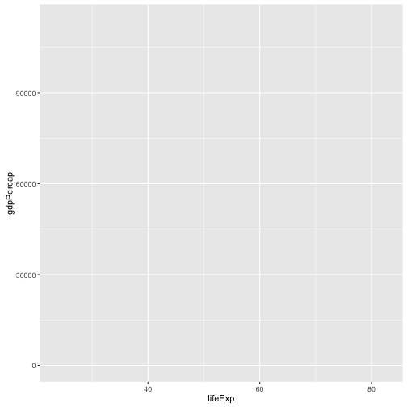

`ggplot` 함수에 데이터를 시각적으로 표현하는 방법을 전달할 필요가 있다. 
**geom** 계층을 추가해서 작업이 수행된다. 본 사례에서, `geom_point`를 사용했다; 
**x**와 **y** 사이 관계를 시각적으로 산점도 형태로 표현하도록 `ggplot`에게 전달한다:

~~~{.r}
ggplot(data = gapminder, aes(x = lifeExp, y = gdpPercap)) +
  geom_point()
~~~

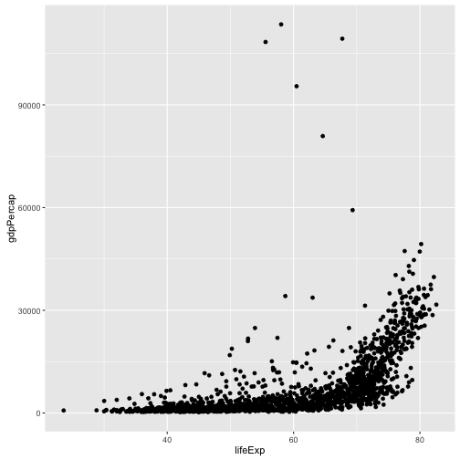

> ## 도전과제 1 {.challenge}
>
> 상기예제를 변경해서, 기대수명이 시간에 따라 어떻게 
> 변해왔는지 시각화하는 그림을 생성한다:
>
> 
> ~~~{.r}
> ggplot(data = gapminder, aes(x = lifeExp, y = gdpPercap)) + geom_point()
> ~~~
>
> **힌트:** `gapminder` 데이터셋에 "year"라는 칼럼이 있는데, **x**-축에 나타나야 된다.
>

> ## 도전과제 2 {.challenge}
>
> 이전 예제와 도전과제에서, `aes` 함수를 사용해서 **geom** 산점도로 **x** 와 **y** 지점을 
> 각 점에 대해 표현했다.
> 변경할 수 있는 또다른 *미학적* 속성은 각 점에 대한 *색깔*이다.
> 앞선 도전과제 코드를 변경해서 "continent" 대륙별로 각 점에 **색**을 입힌다.
> 데이터에서 어떤 경향성을 볼 수 있는가? 예상했던 경향성인가?
>

## 계층

산점도가 아마도 시간에 따라 변하는 정보를 시각화하는데 최선은 아니다.
대신에, `ggplot`에 선그림(line plot)으로 데이터를 시각화한다:

~~~{.r}
ggplot(data = gapminder, aes(x=year, y=lifeExp, by=country, color=continent)) +
  geom_line()
~~~

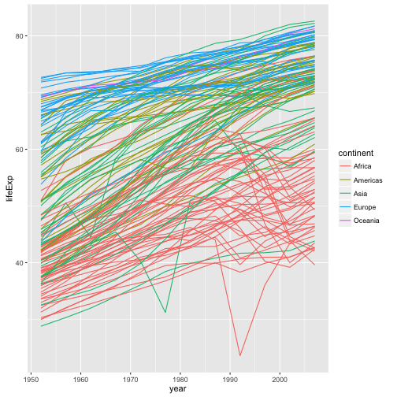

`geom_point` 계층을 추가하는 대신에, `geom_line` 계층을 추가했다.
*미학적*으로 **by**를 추가해서, `ggplot`이 각 국가를 직선으로 연결해서 도식화한다.

하지만, 직선과 점을 함께 시각화하려고 하면 어떨까?
단순히, 또다른 계층을 그림에 추가하면 된다:

~~~{.r}
ggplot(data = gapminder, aes(x=year, y=lifeExp, by=country, color=continent)) +
  geom_line() + geom_point()
~~~

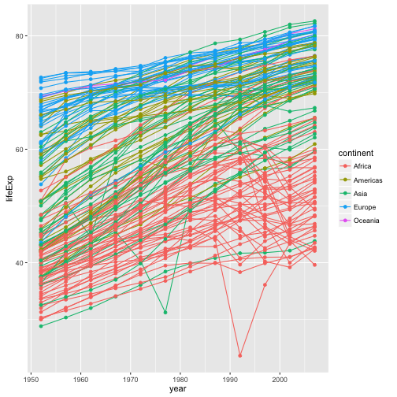

각 계층은 이전 계층 위에 도식화됨에 주목한다.
이번 예제에서, 점이 직선 *위에* 도식화되었다.
다음에 도식화한 시연이 나와있다:

~~~{.r}
ggplot(data = gapminder, aes(x=year, y=lifeExp, by=country)) +
  geom_line(aes(color=continent)) + geom_point()
~~~

이번 예제에서, *미학적*인 **색상** 매핑이 `ggplot`에 전역으로 설정된 점 선택옵션에서 
`geom_line` 계층으로 이동했다. 그래서, 해당 점에는 더이상 적용되지 않는다.
이제 분명하게 직선 위에 점이 도식화된 것을 확인할 수 있다.

> ## 도전과제 3 {.challenge}
>
> 앞선 예제에서 점과 직선 계층을 뒤바꾼다. 어떻게 될까요?
>

## 변환과 통계량

`ggplot`으로 데이터 위에 통계적 모형을 쉽게 겹치게 할 수 있다.
이를 시연하기 위해서, 첫번째 예제로 되돌아간다:

~~~{.r}
ggplot(data = gapminder, aes(x = lifeExp, y = gdpPercap, color=continent)) +
  geom_point()
~~~

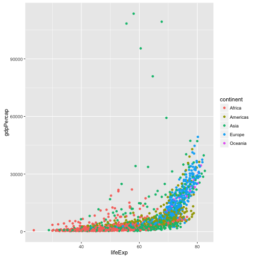

현재, 일인당 GDP에 일부 심각한 이상점이 있어 점사이 내재된 관계를 보기 힘들다.
*scale* 척도함수를 사용해서 y-축 척도를 변경한다.
이러한 제어를 통해 데이터 값과 *미학적인* 시각값 사이 매핑을 제어한다.

~~~{.r}
ggplot(data = gapminder, aes(x = lifeExp, y = gdpPercap)) +
  geom_point() + scale_y_log10()
~~~

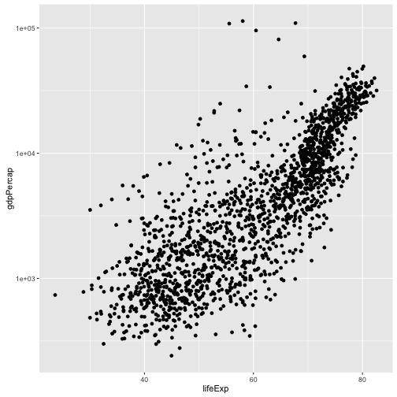

The `log10` function applied a transformation to the values of the gdpPercap
column before rendering them on the plot, so that each multiple of 10 now only
corresponds to an increase in 1 on the transformed scale, e.g. a GDP per capita
of 1,000 is now 3 on the y axis, a value of 10,000 corresponds to 4 on the y
axis and so on. This makes it easier to visualise the spread of data on the
y-axis.

We can fit a simple relationship to the data by adding another layer,
`geom_smooth`:

~~~{.r}
ggplot(data = gapminder, aes(x = lifeExp, y = gdpPercap)) +
  geom_point() + scale_y_log10() + geom_smooth(method="lm")
~~~

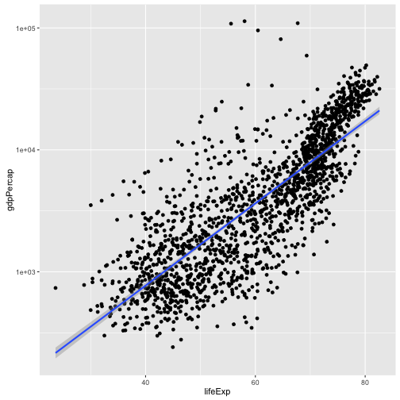

We can make the line thicker by *setting* the **size** aesthetic in the
`geom_smooth` layer:

~~~{.r}
ggplot(data = gapminder, aes(x = lifeExp, y = gdpPercap)) +
  geom_point() + scale_y_log10() + geom_smooth(method="lm", size=1.5)
~~~

There are two ways an *aesthetic* can be specified. Here we *set* the **size**
aesthetic by passing it as an argument to `geom_smooth`. Previously in the
lesson we've used the `aes` function to define a *mapping* between data
variables and their visual representation.

> ## Challenge 4 {.challenge}
>
> Modify the color and size of the points on the point layer in the previous
> example.
>
> Hint: do not use the `aes` function.
>

## Multi-panel figures

Earlier we visualised the change in life expectancy over time across all
countries in one plot. Alternatively, we can split this out over multiple panels
by adding a layer of **facet** panels:

~~~{.r}
ggplot(data = gapminder, aes(x = year, y = lifeExp, color=continent)) +
  geom_line() + facet_wrap( ~ country)
~~~

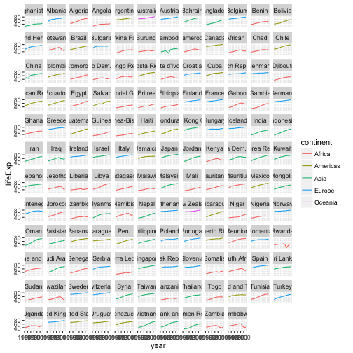

The `facet_wrap` layer took a "formula" as its argument, denoted by the tilde
(~). This tells R to draw a panel for each unique value in the country column
of the gapminder dataset.

## Modifying text

To clean this figure up for a publication we need to change some of the text
elements. The x-axis is way too cluttered, and the y axis should read
"Life expectancy", rather than the column name in the data frame.

We can do this by adding a couple of different layers. The **theme** layer
controls the axis text, and overall text size, and there are special layers
for changing the axis labels. To change the legend title, we need to use the
**scales** layer.

~~~{.r}
ggplot(data = gapminder, aes(x = year, y = lifeExp, color=continent)) +
  geom_line() + facet_wrap( ~ country) +
  xlab("Year") + ylab("Life expectancy") + ggtitle("Figure 1") +
  scale_fill_discrete(name="Continent") +
  theme(axis.text.x=element_blank(), axis.ticks.x=element_blank())
~~~

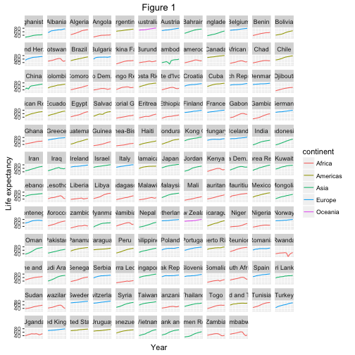

This is just a taste of what you can do with `ggplot2`. RStudio provides a
really useful [cheat sheet][cheat] of the different layers available, and more
extensive documentation is available on the [ggplot2 website][ggplot-doc].
Finally, if you have no idea how to change something, a quick google search will
usually send you to a relevant question and answer on Stack Overflow with reusable
code to modify!

[cheat]: http://www.rstudio.com/wp-content/uploads/2015/03/ggplot2-cheatsheet.pdf
[ggplot-doc]: http://docs.ggplot2.org/current/

> ## Challenge 5 {.challenge}
>
> Create a density plot of GDP per capita, filled by continent.
>
> Advanced:
>  - Transform the x axis to better visualise the data spread.
>  - Add a facet layer to panel the density plots by year.
>

## Challenge solutions

> ## Solution to challenge 1 {.challenge}
>
> Modify the example so that the figure visualise how life expectancy has
> changed over time:
>
> 
> ~~~{.r}
> ggplot(data = gapminder, aes(x = year, y = lifeExp)) + geom_point()
> ~~~
> 
> 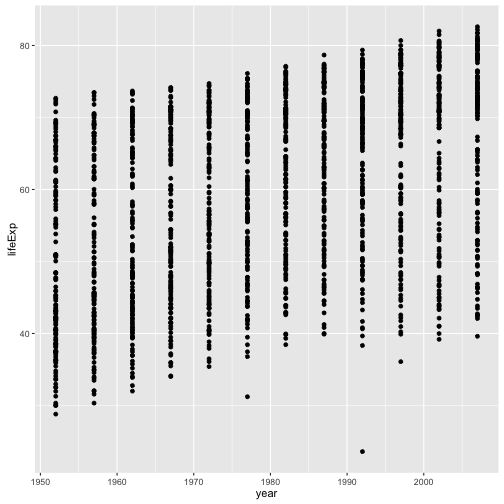
>

> ## Solution to challenge 2 {.challenge}
>
> In the previous examples and challenge we've used the `aes` function to tell
> the scatterplot **geom** about the **x** and **y** locations of each point.
> Another *aesthetic* property we can modify is the point *color*. Modify the
> code from the previous challenge to **color** the points by the "continent"
> column. What trends do you see in the data? Are they what you expected?
>
> 
> ~~~{.r}
> ggplot(data = gapminder, aes(x = year, y = lifeExp, color=continent)) +
>   geom_point()
> ~~~
> 
> 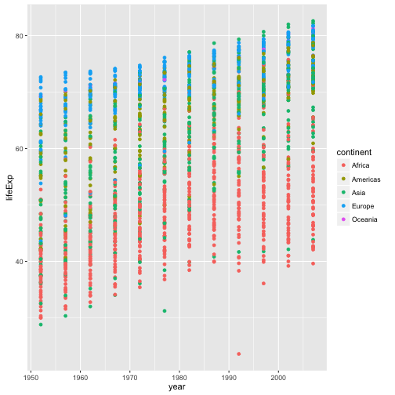
>

> ## Solution to challenge 3 {.challenge}
>
> Switch the order of the point and line layers from the previous example. What
> happened?
>
> 
> ~~~{.r}
> ggplot(data = gapminder, aes(x=year, y=lifeExp, by=country)) +
>  geom_point() + geom_line(aes(color=continent))
> ~~~
> 
> 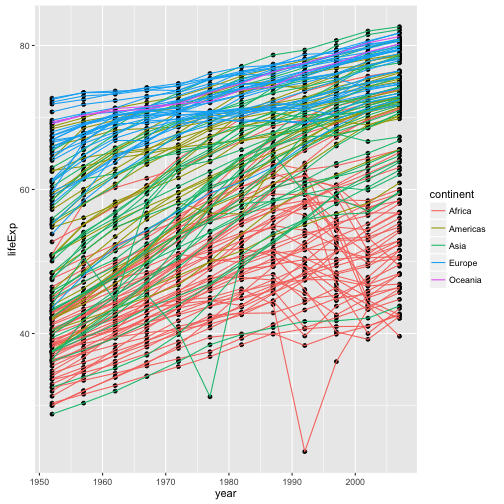
> 
> The lines now get drawn over the points!
>

> ## Solution to challenge 4 {.challenge}
>
> Modify the color and size of the points on the point layer in the previous
> example.
>
> Hint: do not use the `aes` function.
>
> 
> ~~~{.r}
> ggplot(data = gapminder, aes(x = lifeExp, y = gdpPercap)) +
>  geom_point(size=3, color="orange") + scale_y_log10() +
>  geom_smooth(method="lm", size=1.5)
> ~~~
> 
> 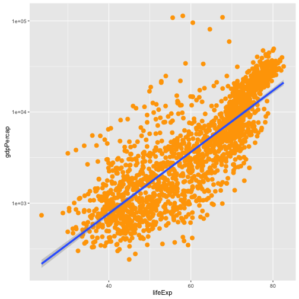
>

> ## Solution to challenge 5 {.challenge}
>
> Create a density plot of GDP per capita, filled by continent.
>
> Advanced:
>  - Transform the x axis to better visualise the data spread.
>  - Add a facet layer to panel the density plots by year.
>
> 
> ~~~{.r}
> ggplot(data = gapminder, aes(x = gdpPercap, fill=continent)) +
>  geom_density(alpha=0.6) + facet_wrap( ~ year) + scale_x_log10()
> ~~~
> 
> 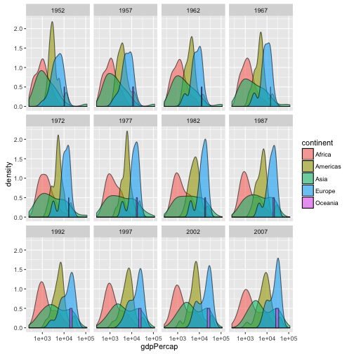
>
